# Zentra Architecture

## 1. High-Level Architecture

### 1.1 System Context

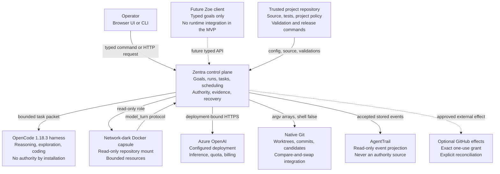
```mermaid
flowchart TB
    Operator["Operator<br/>Browser UI or CLI"]
    Zoe["Future Zoe client<br/>Typed goals only<br/>No runtime integration in the MVP"]
    Repo["Trusted project repository<br/>Source, tests, project policy<br/>Validation and release commands"]
    Zentra["Zentra control plane<br/>Goals, runs, tasks, scheduling<br/>Authority, evidence, recovery"]
    OpenCode["OpenCode 1.18.3 harness<br/>Reasoning, exploration, coding<br/>No authority by installation"]
    Azure["Azure OpenAI<br/>Configured deployment<br/>Inference, quota, billing"]
    Docker["Network-dark Docker capsule<br/>Read-only repository mount<br/>Bounded resources"]
    Git["Native Git<br/>Worktrees, commits, candidates<br/>Compare-and-swap integration"]
    AgentTrail["AgentTrail<br/>Read-only event projection<br/>Never an authority source"]
    GitHub["Optional GitHub effects<br/>Exact one-use grant<br/>Explicit reconciliation"]

    Operator -->|"typed command or HTTP request"| Zentra
    Zoe -.->|"future typed API"| Zentra
    Repo -->|"config, source, validations"| Zentra
    Zentra -->|"bounded task packet"| OpenCode
    Zentra -->|"read-only role"| Docker
    Docker -->|"model_turn protocol"| Zentra
    Zentra -->|"deployment-bound HTTPS"| Azure
    Zentra -->|"argv arrays, shell false"| Git
    Zentra -->|"accepted stored events"| AgentTrail
    Zentra -.->|"approved external effect"| GitHub
```

### 1.2 Internal Component Map

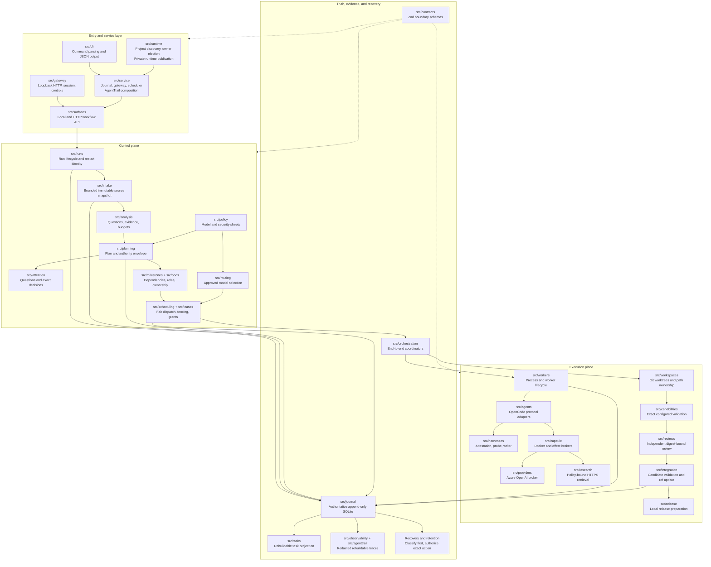
```mermaid
flowchart TB
    subgraph Entry["Entry and service layer"]
        CLI["src/cli<br/>Command parsing and JSON output"]
        Gateway["src/gateway<br/>Loopback HTTP, session, controls"]
        Surface["src/surfaces<br/>Local and HTTP workflow API"]
        Runtime["src/runtime<br/>Project discovery, owner election<br/>Private runtime publication"]
        Service["src/service<br/>Journal, gateway, scheduler<br/>AgentTrail composition"]
    end

    subgraph Control["Control plane"]
        Runs["src/runs<br/>Run lifecycle and restart identity"]
        Intake["src/intake<br/>Bounded immutable source snapshot"]
        Analysis["src/analysis<br/>Questions, evidence, budgets"]
        Planning["src/planning<br/>Plan and authority envelope"]
        Attention["src/attention<br/>Questions and exact decisions"]
        Scheduling["src/scheduling + src/leases<br/>Fair dispatch, fencing, grants"]
        Milestones["src/milestones + src/pods<br/>Dependencies, roles, ownership"]
        Policy["src/policy<br/>Model and security sheets"]
        Routing["src/routing<br/>Approved model selection"]
    end

    subgraph Execution["Execution plane"]
        Workers["src/workers<br/>Process and worker lifecycle"]
        Agents["src/agents<br/>OpenCode protocol adapters"]
        Harnesses["src/harnesses<br/>Attestation, probe, writer"]
        Capsules["src/capsule<br/>Docker and effect brokers"]
        Providers["src/providers<br/>Azure OpenAI broker"]
        Research["src/research<br/>Policy-bound HTTPS retrieval"]
        Workspaces["src/workspaces<br/>Git worktrees and path ownership"]
        Validation["src/capabilities<br/>Exact configured validation"]
        Reviews["src/reviews<br/>Independent digest-bound review"]
        Integration["src/integration<br/>Candidate validation and ref update"]
        Release["src/release<br/>Local release preparation"]
    end

    subgraph Truth["Truth, evidence, and recovery"]
        Contracts["src/contracts<br/>Zod boundary schemas"]
        Journal["src/journal<br/>Authoritative append-only SQLite"]
        Tasks["src/tasks<br/>Rebuildable task projection"]
        Orchestration["src/orchestration<br/>End-to-end coordinators"]
        Observability["src/observability + src/agenttrail<br/>Redacted rebuildable traces"]
        Recovery["Recovery and retention<br/>Classify first, authorize exact action"]
    end

    CLI --> Service
    Gateway --> Surface
    Runtime --> Service
    Service --> Surface
    Surface --> Runs
    Runs --> Intake --> Analysis --> Planning --> Attention
    Planning --> Milestones
    Milestones --> Scheduling
    Policy --> Planning
    Policy --> Routing
    Routing --> Scheduling
    Scheduling --> Orchestration
    Orchestration --> Workers
    Workers --> Agents --> Harnesses
    Agents --> Capsules --> Providers
    Capsules --> Research
    Orchestration --> Workspaces --> Validation --> Reviews --> Integration
    Integration --> Release
    Contracts -.-> Entry
    Contracts -.-> Control
    Contracts -.-> Execution
    Runs --> Journal
    Intake --> Journal
    Planning --> Journal
    Scheduling --> Journal
    Workers --> Journal
    Integration --> Journal
    Journal --> Tasks
    Journal --> Observability
    Journal --> Recovery
```

### 1.3 Supported Harnesses, Providers, and Models

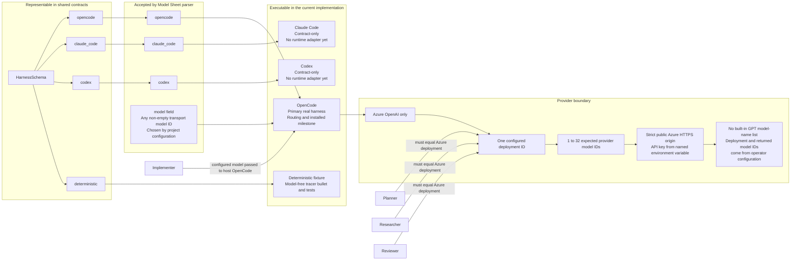
```mermaid
flowchart LR
    subgraph Vocabulary["Representable in shared contracts"]
        HC["HarnessSchema"]
        H1["opencode"]
        H2["claude_code"]
        H3["codex"]
        H4["deterministic"]
        HC --> H1
        HC --> H2
        HC --> H3
        HC --> H4
    end

    subgraph PolicySheet["Accepted by Model Sheet parser"]
        MS1["opencode"]
        MS2["claude_code"]
        MS3["codex"]
        ModelId["model field<br/>Any non-empty transport model ID<br/>Chosen by project configuration"]
    end

    subgraph RuntimeSupport["Executable in the current implementation"]
        RT1["OpenCode<br/>Primary real harness<br/>Routing and installed milestone"]
        RT2["Deterministic fixture<br/>Model-free tracer bullet and tests"]
        RT3["Claude Code<br/>Contract-only<br/>No runtime adapter yet"]
        RT4["Codex<br/>Contract-only<br/>No runtime adapter yet"]
    end

    subgraph ProviderSupport["Provider boundary"]
        P1["Azure OpenAI only"]
        P2["One configured deployment ID"]
        P3["1 to 32 expected provider model IDs"]
        P4["Strict public Azure HTTPS origin<br/>API key from named environment variable"]
        P5["No built-in GPT model-name list<br/>Deployment and returned model IDs<br/>come from operator configuration"]
        P1 --> P2 --> P3 --> P4 --> P5
    end

    H1 --> MS1 --> RT1 --> P1
    H2 --> MS2 --> RT3
    H3 --> MS3 --> RT4
    H4 --> RT2
    ModelId --> RT1

    Planner["Planner"] -->|"must equal Azure deployment"| P2
    Researcher["Researcher"] -->|"must equal Azure deployment"| P2
    Reviewer["Reviewer"] -->|"must equal Azure deployment"| P2
    Implementer["Implementer"] -->|"configured model passed to host OpenCode"| RT1
```

### 1.4 Authority Separation

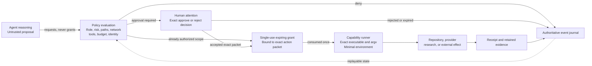
```mermaid
flowchart LR
    Reasoning["Agent reasoning<br/>Untrusted proposal"]
    Policy["Policy evaluation<br/>Role, risk, paths, network<br/>tools, budget, identity"]
    Attention["Human attention<br/>Exact approve or reject decision"]
    Grant["Single-use expiring grant<br/>Bound to exact action packet"]
    Runner["Capability runner<br/>Exact executable and argv<br/>Minimal environment"]
    Effect["Repository, provider<br/>research, or external effect"]
    Evidence["Receipt and retained evidence"]
    Journal["Authoritative event journal"]

    Reasoning -->|"requests, never grants"| Policy
    Policy -->|"deny"| Journal
    Policy -->|"approval required"| Attention
    Policy -->|"already authorized scope"| Grant
    Attention -->|"accepted exact packet"| Grant
    Attention -->|"rejected or expired"| Journal
    Grant -->|"consumed once"| Runner
    Runner --> Effect
    Effect --> Evidence --> Journal
    Journal -.->|"replayable state"| Policy
```

### 1.5 Event-Sourced Domain

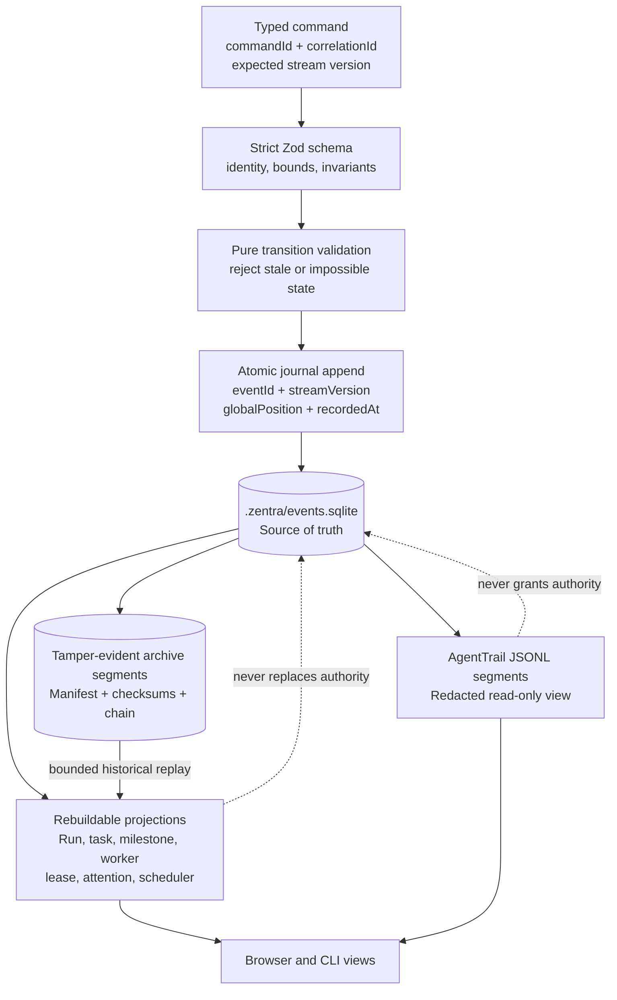
```mermaid
flowchart TB
    Command["Typed command<br/>commandId + correlationId<br/>expected stream version"]
    Schema["Strict Zod schema<br/>identity, bounds, invariants"]
    Transition["Pure transition validation<br/>reject stale or impossible state"]
    Append["Atomic journal append<br/>eventId + streamVersion<br/>globalPosition + recordedAt"]
    SQLite[(".zentra/events.sqlite<br/>Source of truth")]
    Archive[("Tamper-evident archive segments<br/>Manifest + checksums + chain")]
    Projection["Rebuildable projections<br/>Run, task, milestone, worker<br/>lease, attention, scheduler"]
    Trace["AgentTrail JSONL segments<br/>Redacted read-only view"]
    UI["Browser and CLI views"]

    Command --> Schema --> Transition --> Append --> SQLite
    SQLite --> Projection --> UI
    SQLite --> Trace --> UI
    SQLite --> Archive
    Archive -->|"bounded historical replay"| Projection
    Projection -.->|"never replaces authority"| SQLite
    Trace -.->|"never grants authority"| SQLite
```

## 2. How Data Enters

### 2.1 Service Startup and Local Trust Establishment

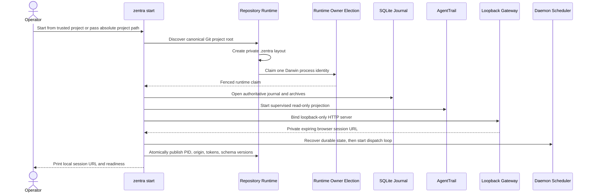
```mermaid
sequenceDiagram
    actor Operator
    participant CLI as zentra start
    participant Discovery as Repository Runtime
    participant Owner as Runtime Owner Election
    participant Journal as SQLite Journal
    participant Trace as AgentTrail
    participant Gateway as Loopback Gateway
    participant Scheduler as Daemon Scheduler

    Operator->>CLI: Start from trusted project or pass absolute project path
    CLI->>Discovery: Discover canonical Git project root
    Discovery->>Discovery: Create private .zentra layout
    Discovery->>Owner: Claim one Darwin process identity
    Owner-->>CLI: Fenced runtime claim
    CLI->>Journal: Open authoritative journal and archives
    CLI->>Trace: Start supervised read-only projection
    CLI->>Gateway: Bind loopback-only HTTP server
    Gateway-->>CLI: Private expiring browser session URL
    CLI->>Scheduler: Recover durable state, then start dispatch loop
    CLI->>Discovery: Atomically publish PID, origin, tokens, schema versions
    CLI-->>Operator: Print local session URL and readiness
```

### 2.2 Browser and CLI Workflow Ingress

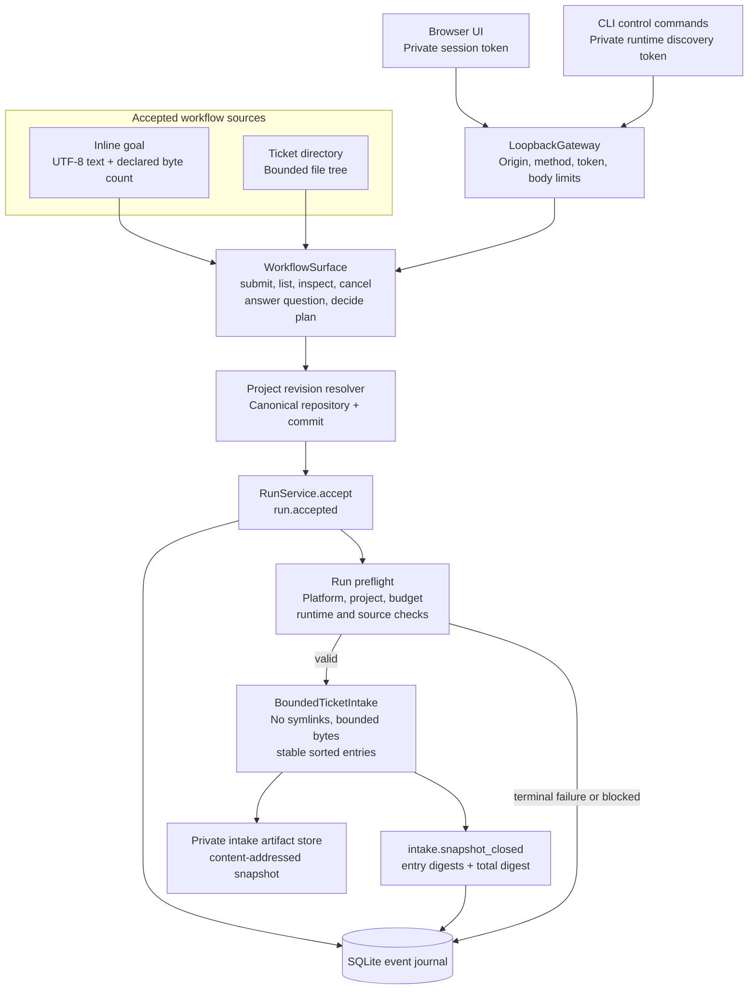
```mermaid
flowchart TB
    subgraph Sources["Accepted workflow sources"]
        Inline["Inline goal<br/>UTF-8 text + declared byte count"]
        Ticket["Ticket directory<br/>Bounded file tree"]
    end

    Browser["Browser UI<br/>Private session token"]
    CLI["CLI control commands<br/>Private runtime discovery token"]
    Gateway["LoopbackGateway<br/>Origin, method, token, body limits"]
    Surface["WorkflowSurface<br/>submit, list, inspect, cancel<br/>answer question, decide plan"]
    Revision["Project revision resolver<br/>Canonical repository + commit"]
    Run["RunService.accept<br/>run.accepted"]
    Preflight["Run preflight<br/>Platform, project, budget<br/>runtime and source checks"]
    Intake["BoundedTicketIntake<br/>No symlinks, bounded bytes<br/>stable sorted entries"]
    Artifact["Private intake artifact store<br/>content-addressed snapshot"]
    Closure["intake.snapshot_closed<br/>entry digests + total digest"]
    Journal[("SQLite event journal")]

    Browser --> Gateway
    CLI --> Gateway
    Gateway --> Surface
    Inline --> Surface
    Ticket --> Surface
    Surface --> Revision --> Run --> Journal
    Run --> Preflight
    Preflight -->|"valid"| Intake
    Preflight -->|"terminal failure or blocked"| Journal
    Intake --> Artifact
    Intake --> Closure --> Journal
```

### 2.3 Policy, Model, Provider, and Project Configuration Ingress

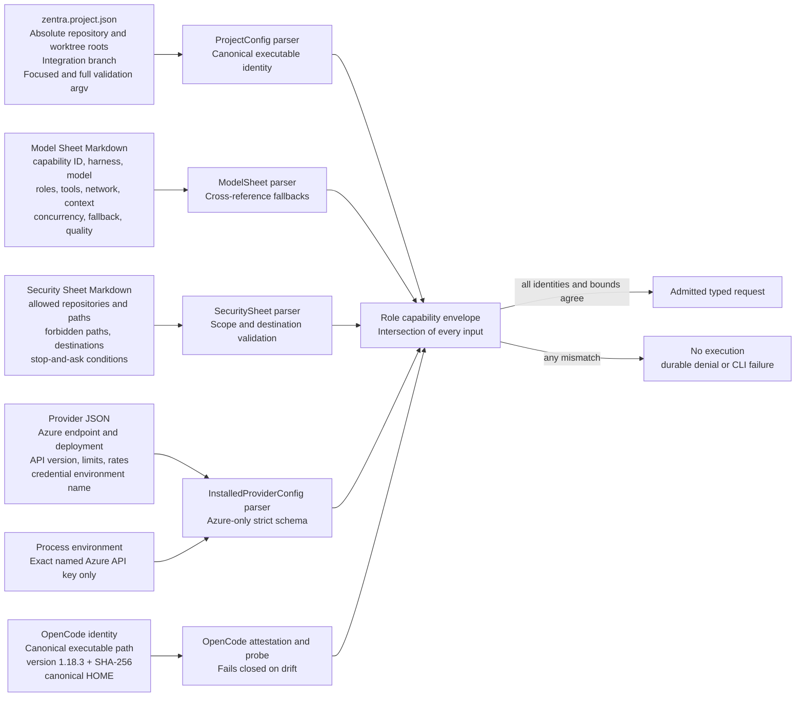
```mermaid
flowchart LR
    ProjectJson["zentra.project.json<br/>Absolute repository and worktree roots<br/>Integration branch<br/>Focused and full validation argv"]
    ModelMd["Model Sheet Markdown<br/>capability ID, harness, model<br/>roles, tools, network, context<br/>concurrency, fallback, quality"]
    SecurityMd["Security Sheet Markdown<br/>allowed repositories and paths<br/>forbidden paths, destinations<br/>stop-and-ask conditions"]
    ProviderJson["Provider JSON<br/>Azure endpoint and deployment<br/>API version, limits, rates<br/>credential environment name"]
    Credential["Process environment<br/>Exact named Azure API key only"]
    OpenCodeIdentity["OpenCode identity<br/>Canonical executable path<br/>version 1.18.3 + SHA-256<br/>canonical HOME"]

    ProjectParser["ProjectConfig parser<br/>Canonical executable identity"]
    ModelParser["ModelSheet parser<br/>Cross-reference fallbacks"]
    SecurityParser["SecuritySheet parser<br/>Scope and destination validation"]
    ProviderParser["InstalledProviderConfig parser<br/>Azure-only strict schema"]
    Attestation["OpenCode attestation and probe<br/>Fails closed on drift"]
    Admission["Role capability envelope<br/>Intersection of every input"]

    ProjectJson --> ProjectParser --> Admission
    ModelMd --> ModelParser --> Admission
    SecurityMd --> SecurityParser --> Admission
    ProviderJson --> ProviderParser --> Admission
    Credential --> ProviderParser
    OpenCodeIdentity --> Attestation --> Admission
    Admission -->|"all identities and bounds agree"| Ready["Admitted typed request"]
    Admission -->|"any mismatch"| Denied["No execution<br/>durable denial or CLI failure"]
```

### 2.4 Run Intake Lifecycle

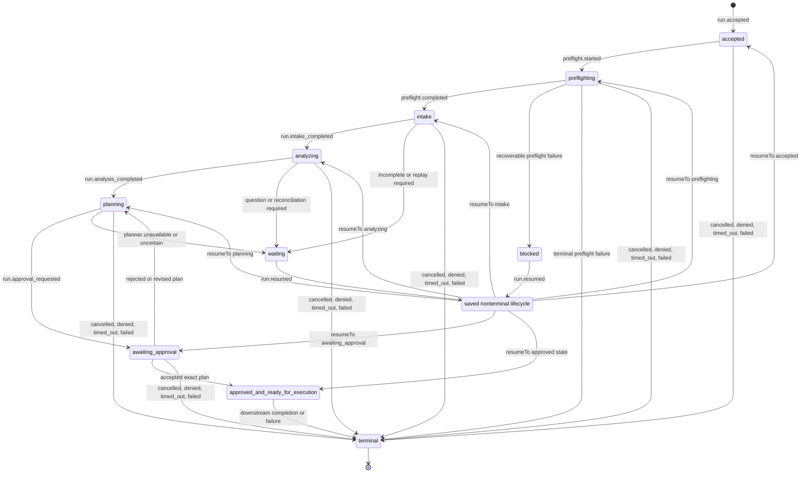
```mermaid
stateDiagram-v2
    [*] --> accepted: run.accepted
    accepted --> preflighting: preflight.started
    preflighting --> intake: preflight.completed
    preflighting --> blocked: recoverable preflight failure
    preflighting --> terminal: terminal preflight failure
    intake --> analyzing: run.intake_completed
    intake --> waiting: incomplete or replay required
    analyzing --> planning: run.analysis_completed
    analyzing --> waiting: question or reconciliation required
    planning --> awaiting_approval: run.approval_requested
    planning --> waiting: planner unavailable or uncertain
    awaiting_approval --> approved_and_ready_for_execution: accepted exact plan
    awaiting_approval --> planning: rejected or revised plan
    state "saved nonterminal lifecycle" as resumed
    waiting --> resumed: run.resumed
    blocked --> resumed: run.resumed
    resumed --> accepted: resumeTo accepted
    resumed --> preflighting: resumeTo preflighting
    resumed --> intake: resumeTo intake
    resumed --> analyzing: resumeTo analyzing
    resumed --> planning: resumeTo planning
    resumed --> awaiting_approval: resumeTo awaiting_approval
    resumed --> approved_and_ready_for_execution: resumeTo approved state
    accepted --> terminal: cancelled, denied, timed_out, failed
    preflighting --> terminal: cancelled, denied, timed_out, failed
    intake --> terminal: cancelled, denied, timed_out, failed
    analyzing --> terminal: cancelled, denied, timed_out, failed
    planning --> terminal: cancelled, denied, timed_out, failed
    awaiting_approval --> terminal: cancelled, denied, timed_out, failed
    approved_and_ready_for_execution --> terminal: downstream completion or failure
    terminal --> [*]
```

## 3. How Data Moves Through the System

### 3.1 Browser Workflow: Intake Through Approval Boundary

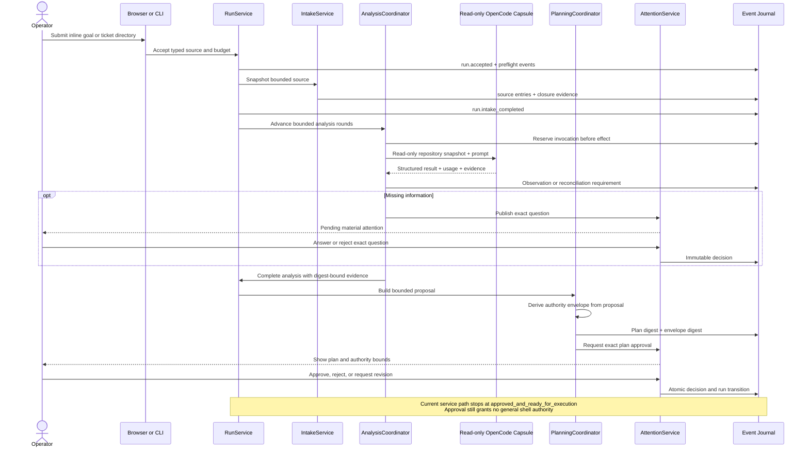
```mermaid
sequenceDiagram
    actor Operator
    participant UI as Browser or CLI
    participant Run as RunService
    participant Intake as IntakeService
    participant Analysis as AnalysisCoordinator
    participant Capsule as Read-only OpenCode Capsule
    participant Plan as PlanningCoordinator
    participant Attention as AttentionService
    participant Journal as Event Journal

    Operator->>UI: Submit inline goal or ticket directory
    UI->>Run: Accept typed source and budget
    Run->>Journal: run.accepted + preflight events
    Run->>Intake: Snapshot bounded source
    Intake->>Journal: source entries + closure evidence
    Run->>Journal: run.intake_completed
    Run->>Analysis: Advance bounded analysis rounds
    Analysis->>Journal: Reserve invocation before effect
    Analysis->>Capsule: Read-only repository snapshot + prompt
    Capsule-->>Analysis: Structured result + usage + evidence
    Analysis->>Journal: Observation or reconciliation requirement
    opt Missing information
        Analysis->>Attention: Publish exact question
        Attention-->>Operator: Pending material attention
        Operator->>Attention: Answer or reject exact question
        Attention->>Journal: Immutable decision
    end
    Analysis->>Run: Complete analysis with digest-bound evidence
    Run->>Plan: Build bounded proposal
    Plan->>Plan: Derive authority envelope from proposal
    Plan->>Journal: Plan digest + envelope digest
    Plan->>Attention: Request exact plan approval
    Attention-->>Operator: Show plan and authority bounds
    Operator->>Attention: Approve, reject, or request revision
    Attention->>Journal: Atomic decision and run transition
    Note over Run,Journal: Current service path stops at approved_and_ready_for_execution<br/>Approval still grants no general shell authority
```

### 3.2 Installed Four-Role Milestone

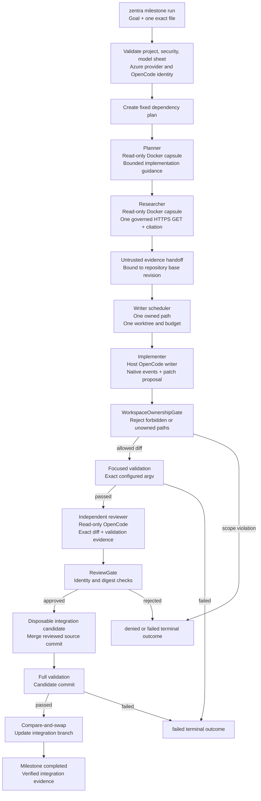
```mermaid
flowchart TB
    Start["zentra milestone run<br/>Goal + one exact file"]
    Admit["Validate project, security, model sheet<br/>Azure provider and OpenCode identity"]
    Plan["Create fixed dependency plan"]
    Planner["Planner<br/>Read-only Docker capsule<br/>Bounded implementation guidance"]
    Researcher["Researcher<br/>Read-only Docker capsule<br/>One governed HTTPS GET + citation"]
    Guidance["Untrusted evidence handoff<br/>Bound to repository base revision"]
    WriterSchedule["Writer scheduler<br/>One owned path<br/>One worktree and budget"]
    Writer["Implementer<br/>Host OpenCode writer<br/>Native events + patch proposal"]
    Ownership["WorkspaceOwnershipGate<br/>Reject forbidden or unowned paths"]
    Focused["Focused validation<br/>Exact configured argv"]
    Reviewer["Independent reviewer<br/>Read-only OpenCode<br/>Exact diff + validation evidence"]
    Gate["ReviewGate<br/>Identity and digest checks"]
    Candidate["Disposable integration candidate<br/>Merge reviewed source commit"]
    Full["Full validation<br/>Candidate commit"]
    CAS["Compare-and-swap<br/>Update integration branch"]
    Finish["Milestone completed<br/>Verified integration evidence"]

    Start --> Admit --> Plan --> Planner --> Researcher --> Guidance
    Guidance --> WriterSchedule --> Writer --> Ownership
    Ownership -->|"allowed diff"| Focused
    Ownership -->|"scope violation"| Denied["denied or failed terminal outcome"]
    Focused -->|"passed"| Reviewer
    Focused -->|"failed"| Failed["failed terminal outcome"]
    Reviewer --> Gate
    Gate -->|"approved"| Candidate --> Full
    Gate -->|"rejected"| Denied
    Full -->|"passed"| CAS --> Finish
    Full -->|"failed"| Failed
```

### 3.3 One Brokered Model Turn

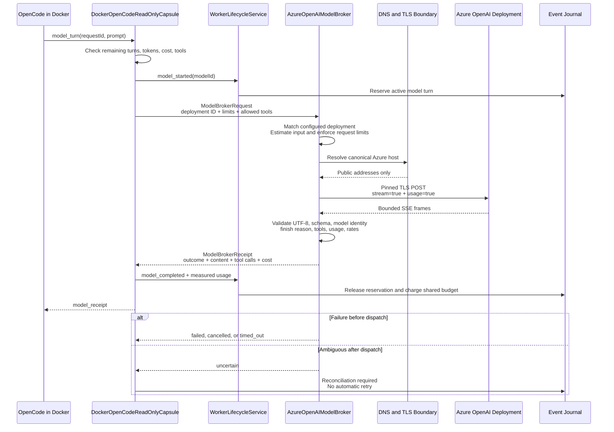
```mermaid
sequenceDiagram
    participant Agent as OpenCode in Docker
    participant Capsule as DockerOpenCodeReadOnlyCapsule
    participant Worker as WorkerLifecycleService
    participant Broker as AzureOpenAIModelBroker
    participant DNS as DNS and TLS Boundary
    participant Azure as Azure OpenAI Deployment
    participant Journal as Event Journal

    Agent->>Capsule: model_turn(requestId, prompt)
    Capsule->>Capsule: Check remaining turns, tokens, cost, tools
    Capsule->>Worker: model_started(modelId)
    Worker->>Journal: Reserve active model turn
    Capsule->>Broker: ModelBrokerRequest<br/>deployment ID + limits + allowed tools
    Broker->>Broker: Match configured deployment<br/>Estimate input and enforce request limits
    Broker->>DNS: Resolve canonical Azure host
    DNS-->>Broker: Public addresses only
    Broker->>Azure: Pinned TLS POST<br/>stream=true + usage=true
    Azure-->>Broker: Bounded SSE frames
    Broker->>Broker: Validate UTF-8, schema, model identity<br/>finish reason, tools, usage, rates
    Broker-->>Capsule: ModelBrokerReceipt<br/>outcome + content + tool calls + cost
    Capsule->>Worker: model_completed + measured usage
    Worker->>Journal: Release reservation and charge shared budget
    Capsule-->>Agent: model_receipt
    alt Failure before dispatch
        Broker-->>Capsule: failed, cancelled, or timed_out
    else Ambiguous after dispatch
        Broker-->>Capsule: uncertain
        Capsule->>Journal: Reconciliation required<br/>No automatic retry
    end
```

### 3.4 Model Routing

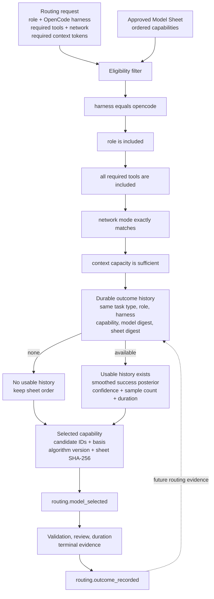
```mermaid
flowchart TB
    Request["Routing request<br/>role + OpenCode harness<br/>required tools + network<br/>required context tokens"]
    Sheet["Approved Model Sheet<br/>ordered capabilities"]
    Filter["Eligibility filter"]
    Harness["harness equals opencode"]
    Role["role is included"]
    Tools["all required tools are included"]
    Network["network mode exactly matches"]
    Context["context capacity is sufficient"]
    History["Durable outcome history<br/>same task type, role, harness<br/>capability, model digest, sheet digest"]
    Cold["No usable history<br/>keep sheet order"]
    Rank["Usable history exists<br/>smoothed success posterior<br/>confidence + sample count + duration"]
    Select["Selected capability<br/>candidate IDs + basis<br/>algorithm version + sheet SHA-256"]
    Retain["routing.model_selected"]
    Outcome["Validation, review, duration<br/>terminal evidence"]
    Record["routing.outcome_recorded"]

    Request --> Filter
    Sheet --> Filter
    Filter --> Harness --> Role --> Tools --> Network --> Context
    Context --> History
    History -->|"none"| Cold --> Select
    History -->|"available"| Rank --> Select
    Select --> Retain --> Outcome --> Record
    Record -.->|"future routing evidence"| History
```

### 3.5 Scheduler, Leases, and Concurrency

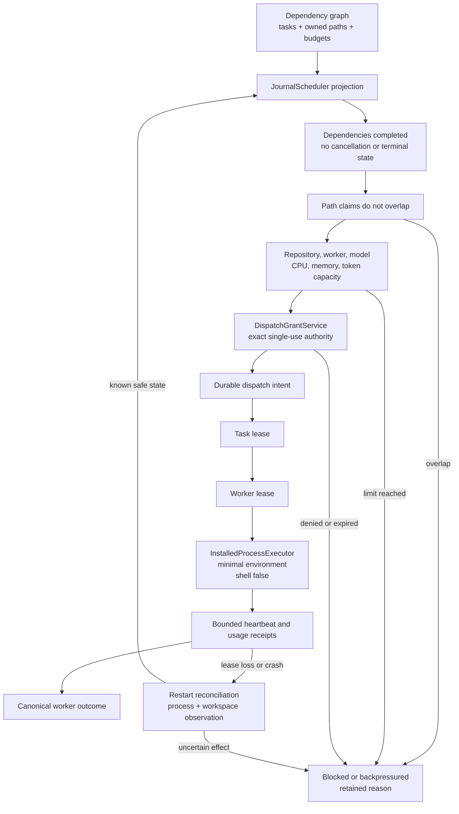
```mermaid
flowchart TB
    Plan["Dependency graph<br/>tasks + owned paths + budgets"]
    Projection["JournalScheduler projection"]
    Ready["Dependencies completed<br/>no cancellation or terminal state"]
    PathCheck["Path claims do not overlap"]
    Capacity["Repository, worker, model<br/>CPU, memory, token capacity"]
    Grant["DispatchGrantService<br/>exact single-use authority"]
    Intent["Durable dispatch intent"]
    TaskLease["Task lease"]
    WorkerLease["Worker lease"]
    Process["InstalledProcessExecutor<br/>minimal environment<br/>shell false"]
    Heartbeat["Bounded heartbeat and usage receipts"]
    Terminal["Canonical worker outcome"]
    Reconcile["Restart reconciliation<br/>process + workspace observation"]
    Backpressure["Blocked or backpressured<br/>retained reason"]

    Plan --> Projection --> Ready --> PathCheck --> Capacity --> Grant --> Intent
    Intent --> TaskLease --> WorkerLease --> Process --> Heartbeat --> Terminal
    PathCheck -->|"overlap"| Backpressure
    Capacity -->|"limit reached"| Backpressure
    Grant -->|"denied or expired"| Backpressure
    Heartbeat -->|"lease loss or crash"| Reconcile
    Reconcile -->|"known safe state"| Projection
    Reconcile -->|"uncertain effect"| Backpressure
```

### 3.6 Task and Worker State Machines

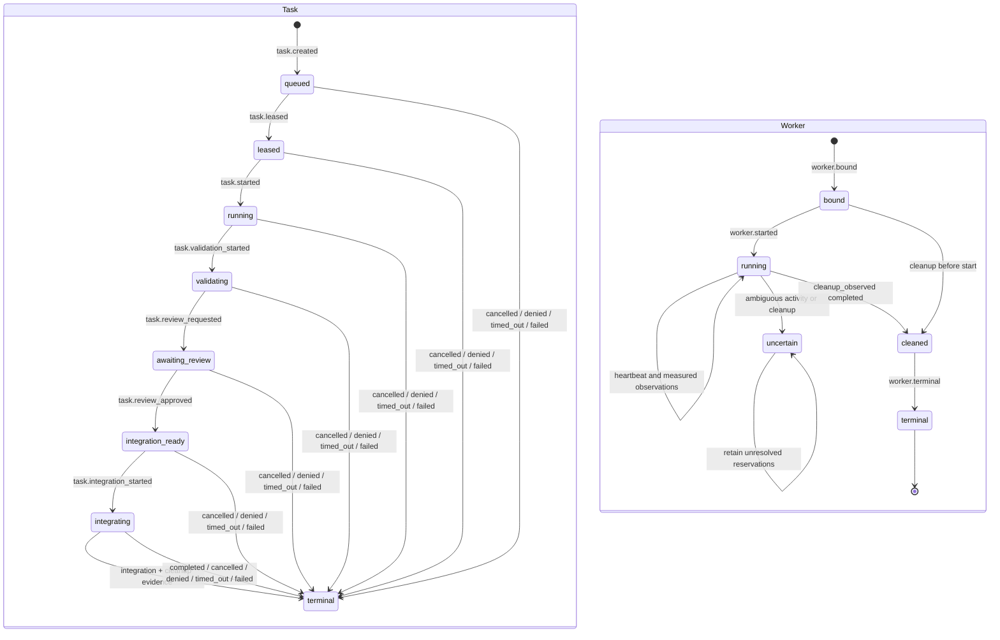
```mermaid
stateDiagram-v2
    state "Task" as Task {
        state "queued" as task_queued
        state "leased" as task_leased
        state "running" as task_running
        state "validating" as task_validating
        state "awaiting_review" as task_awaiting_review
        state "integration_ready" as task_integration_ready
        state "integrating" as task_integrating
        state "terminal" as task_terminal
        [*] --> task_queued: task.created
        task_queued --> task_leased: task.leased
        task_leased --> task_running: task.started
        task_running --> task_validating: task.validation_started
        task_validating --> task_awaiting_review: task.review_requested
        task_awaiting_review --> task_integration_ready: task.review_approved
        task_integration_ready --> task_integrating: task.integration_started
        task_integrating --> task_terminal: integration + cleanup evidence
        task_queued --> task_terminal: cancelled / denied / timed_out / failed
        task_leased --> task_terminal: cancelled / denied / timed_out / failed
        task_running --> task_terminal: cancelled / denied / timed_out / failed
        task_validating --> task_terminal: cancelled / denied / timed_out / failed
        task_awaiting_review --> task_terminal: cancelled / denied / timed_out / failed
        task_integration_ready --> task_terminal: cancelled / denied / timed_out / failed
        task_integrating --> task_terminal: completed / cancelled / denied / timed_out / failed
    }

    state "Worker" as Worker {
        state "bound" as worker_bound
        state "running" as worker_running
        state "uncertain" as worker_uncertain
        state "cleaned" as worker_cleaned
        state "terminal" as worker_terminal
        [*] --> worker_bound: worker.bound
        worker_bound --> worker_running: worker.started
        worker_running --> worker_running: heartbeat and measured observations
        worker_running --> worker_uncertain: ambiguous activity or cleanup
        worker_running --> worker_cleaned: cleanup_observed completed
        worker_bound --> worker_cleaned: cleanup before start
        worker_uncertain --> worker_uncertain: retain unresolved reservations
        worker_cleaned --> worker_terminal: worker.terminal
        worker_terminal --> [*]
    }
```

### 3.7 Journal Write and Projection Fan-Out

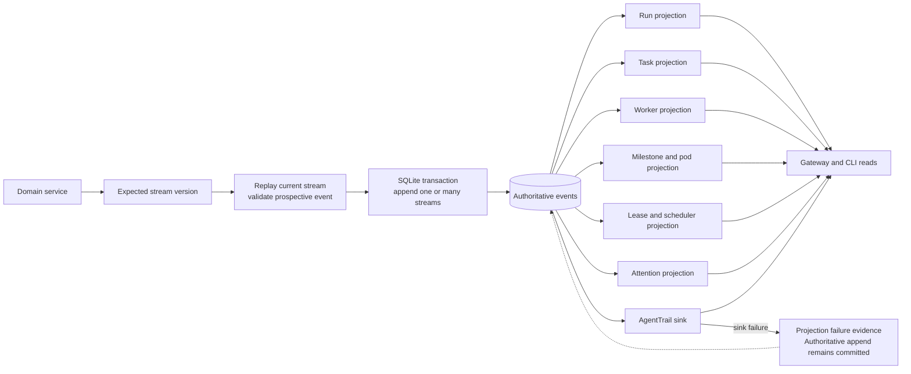
```mermaid
flowchart LR
    Domain["Domain service"]
    Expected["Expected stream version"]
    Validate["Replay current stream<br/>validate prospective event"]
    Atomic["SQLite transaction<br/>append one or many streams"]
    Source[("Authoritative events")]
    RunP["Run projection"]
    TaskP["Task projection"]
    WorkerP["Worker projection"]
    MilestoneP["Milestone and pod projection"]
    SchedulerP["Lease and scheduler projection"]
    AttentionP["Attention projection"]
    AgentTail["AgentTrail sink"]
    UI["Gateway and CLI reads"]
    Failure["Projection failure evidence<br/>Authoritative append remains committed"]

    Domain --> Expected --> Validate --> Atomic --> Source
    Source --> RunP --> UI
    Source --> TaskP --> UI
    Source --> WorkerP --> UI
    Source --> MilestoneP --> UI
    Source --> SchedulerP --> UI
    Source --> AttentionP --> UI
    Source --> AgentTail --> UI
    AgentTail -->|"sink failure"| Failure
    Failure -.-> Source
```

## 4. What Happens at the End

### 4.1 Validation, Review, and Integration Commit Protocol

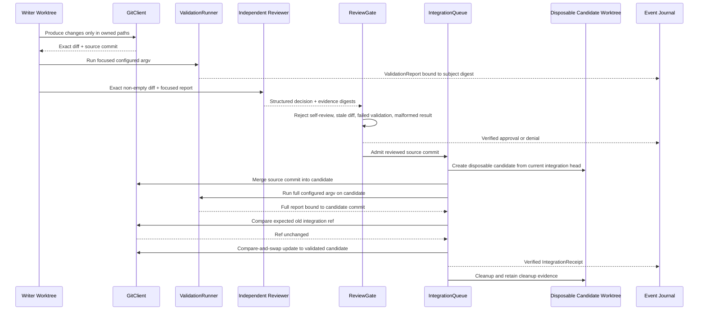
```mermaid
sequenceDiagram
    participant Writer as Writer Worktree
    participant Git as GitClient
    participant Validation as ValidationRunner
    participant Review as Independent Reviewer
    participant Gate as ReviewGate
    participant Queue as IntegrationQueue
    participant Candidate as Disposable Candidate Worktree
    participant Journal as Event Journal

    Writer->>Git: Produce changes only in owned paths
    Git-->>Writer: Exact diff + source commit
    Writer->>Validation: Run focused configured argv
    Validation-->>Journal: ValidationReport bound to subject digest
    Writer->>Review: Exact non-empty diff + focused report
    Review-->>Gate: Structured decision + evidence digests
    Gate->>Gate: Reject self-review, stale diff, failed validation, malformed result
    Gate-->>Journal: Verified approval or denial
    Gate->>Queue: Admit reviewed source commit
    Queue->>Candidate: Create disposable candidate from current integration head
    Queue->>Git: Merge source commit into candidate
    Queue->>Validation: Run full configured argv on candidate
    Validation-->>Queue: Full report bound to candidate commit
    Queue->>Git: Compare expected old integration ref
    Git-->>Queue: Ref unchanged
    Queue->>Git: Compare-and-swap update to validated candidate
    Queue-->>Journal: Verified IntegrationReceipt
    Queue->>Candidate: Cleanup and retain cleanup evidence
```

### 4.2 Terminal Outcome Decision

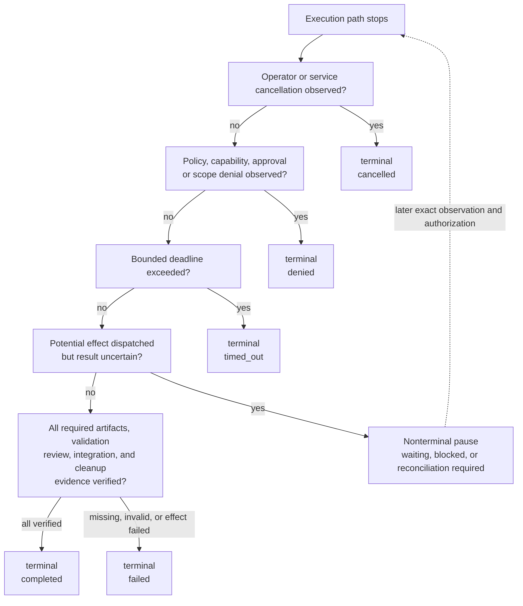
```mermaid
flowchart TB
    End["Execution path stops"]
    Cancel["Operator or service cancellation observed?"]
    Denial["Policy, capability, approval<br/>or scope denial observed?"]
    Timeout["Bounded deadline exceeded?"]
    Uncertain["Potential effect dispatched<br/>but result uncertain?"]
    Evidence["All required artifacts, validation<br/>review, integration, and cleanup<br/>evidence verified?"]
    Completed["terminal<br/>completed"]
    Cancelled["terminal<br/>cancelled"]
    Denied["terminal<br/>denied"]
    TimedOut["terminal<br/>timed_out"]
    Failed["terminal<br/>failed"]
    Pause["Nonterminal pause<br/>waiting, blocked, or reconciliation required"]

    End --> Cancel
    Cancel -->|"yes"| Cancelled
    Cancel -->|"no"| Denial
    Denial -->|"yes"| Denied
    Denial -->|"no"| Timeout
    Timeout -->|"yes"| TimedOut
    Timeout -->|"no"| Uncertain
    Uncertain -->|"yes"| Pause
    Uncertain -->|"no"| Evidence
    Evidence -->|"all verified"| Completed
    Evidence -->|"missing, invalid, or effect failed"| Failed
    Pause -.->|"later exact observation and authorization"| End
```

### 4.3 Final Evidence Products

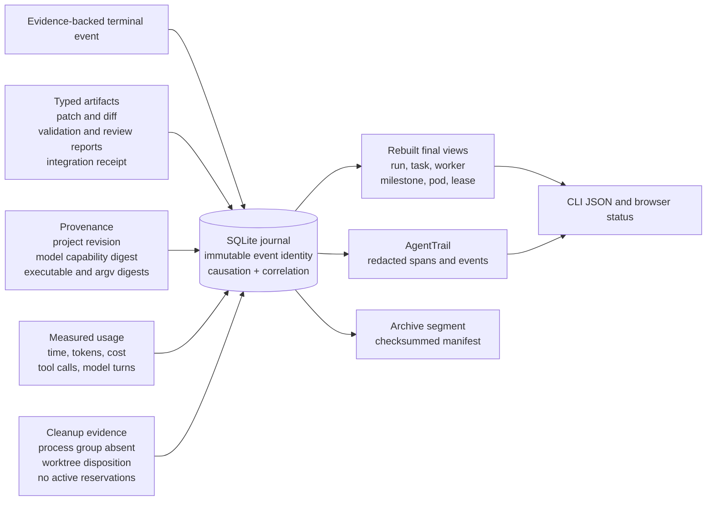
```mermaid
flowchart LR
    Completion["Evidence-backed terminal event"]
    Journal[("SQLite journal<br/>immutable event identity<br/>causation + correlation")]
    Artifacts["Typed artifacts<br/>patch and diff<br/>validation and review reports<br/>integration receipt"]
    Provenance["Provenance<br/>project revision<br/>model capability digest<br/>executable and argv digests"]
    Usage["Measured usage<br/>time, tokens, cost<br/>tool calls, model turns"]
    Cleanup["Cleanup evidence<br/>process group absent<br/>worktree disposition<br/>no active reservations"]
    Projection["Rebuilt final views<br/>run, task, worker<br/>milestone, pod, lease"]
    Trace["AgentTrail<br/>redacted spans and events"]
    User["CLI JSON and browser status"]
    Archive["Archive segment<br/>checksummed manifest"]

    Completion --> Journal
    Artifacts --> Journal
    Provenance --> Journal
    Usage --> Journal
    Cleanup --> Journal
    Journal --> Projection --> User
    Journal --> Trace --> User
    Journal --> Archive
```

### 4.4 Uncertainty and Recovery

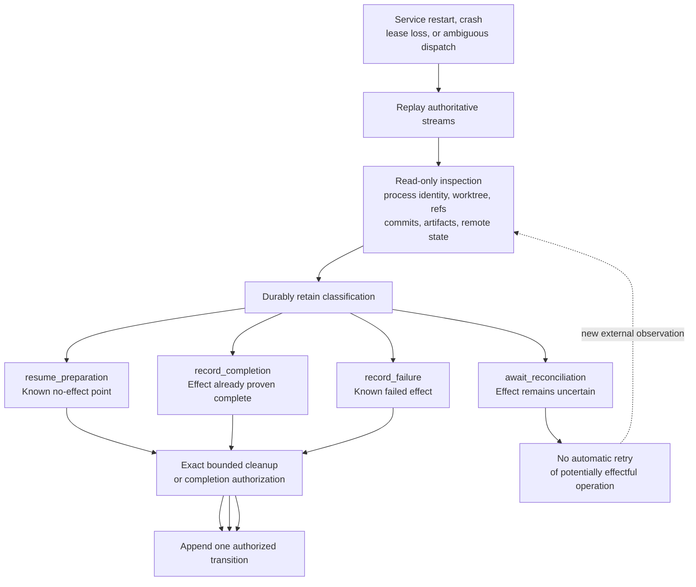
```mermaid
flowchart TB
    Restart["Service restart, crash<br/>lease loss, or ambiguous dispatch"]
    Replay["Replay authoritative streams"]
    Inspect["Read-only inspection<br/>process identity, worktree, refs<br/>commits, artifacts, remote state"]
    Classify["Durably retain classification"]
    Resume["resume_preparation<br/>Known no-effect point"]
    Completion["record_completion<br/>Effect already proven complete"]
    Failure["record_failure<br/>Known failed effect"]
    Await["await_reconciliation<br/>Effect remains uncertain"]
    Authorize["Exact bounded cleanup<br/>or completion authorization"]
    Apply["Append one authorized transition"]
    NoRetry["No automatic retry<br/>of potentially effectful operation"]

    Restart --> Replay --> Inspect --> Classify
    Classify --> Resume --> Authorize --> Apply
    Classify --> Completion --> Authorize --> Apply
    Classify --> Failure --> Authorize --> Apply
    Classify --> Await --> NoRetry
    NoRetry -.->|"new external observation"| Inspect
```

### 4.5 Local Release and External-Effect Boundary

```mermaid
flowchart LR
    Integrated["Verified integrated commit"]
    ReleasePacket["Immutable local release packet"]
    Detached["Detached exact-commit worktree"]
    Build["Configured build, package<br/>and verification argv"]
    Hashes["Artifact paths + SHA-256<br/>step receipts + repository proof"]
    Boundary["Milestone paused<br/>release_boundary attention"]
    Human["Separate human decision"]
    Grant["Exact external-effect grant"]
    GitHub["Push or pull request dispatch"]
    Reconcile["Read remote state<br/>prove completed or failed"]
    Done["External effect evidence"]

    Integrated --> ReleasePacket --> Detached --> Build --> Hashes --> Boundary
    Boundary --> Human --> Grant --> GitHub --> Reconcile --> Done
    GitHub -->|"ambiguous after dispatch"| Reconcile
    Boundary -.->|"default endpoint"| Stop["No tag, push, publish<br/>or deployment occurs"]
```

